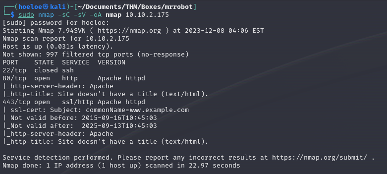
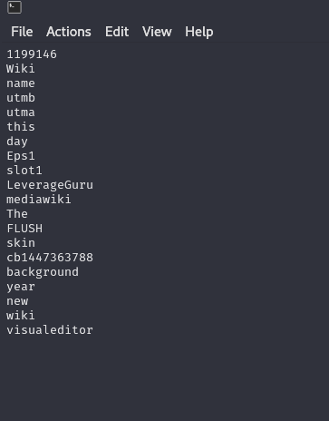
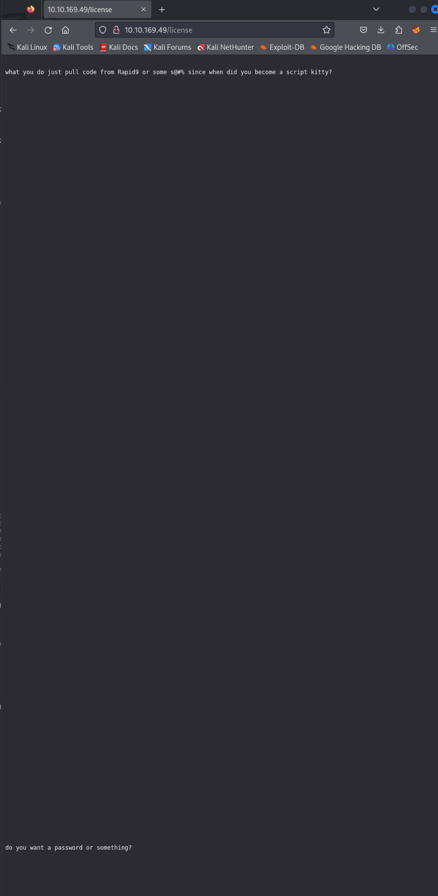
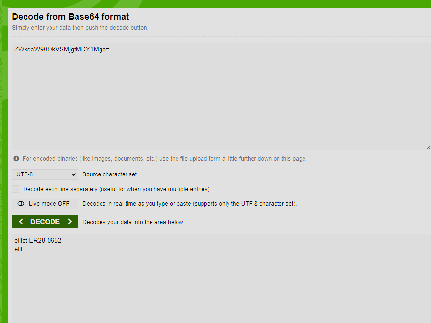
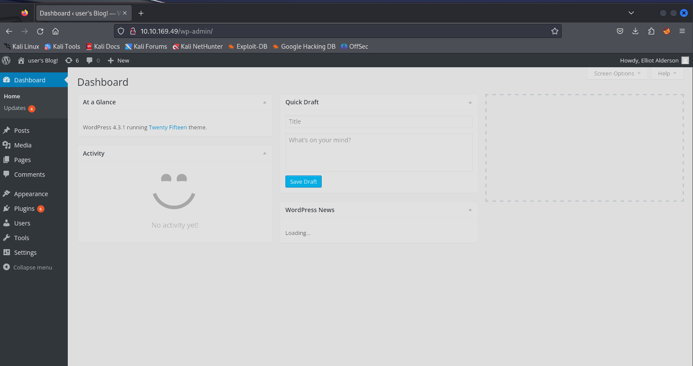
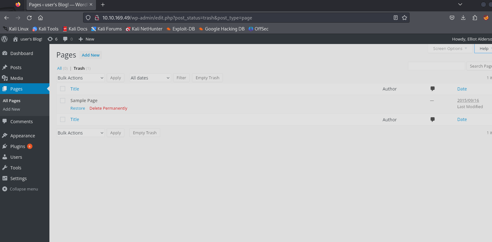
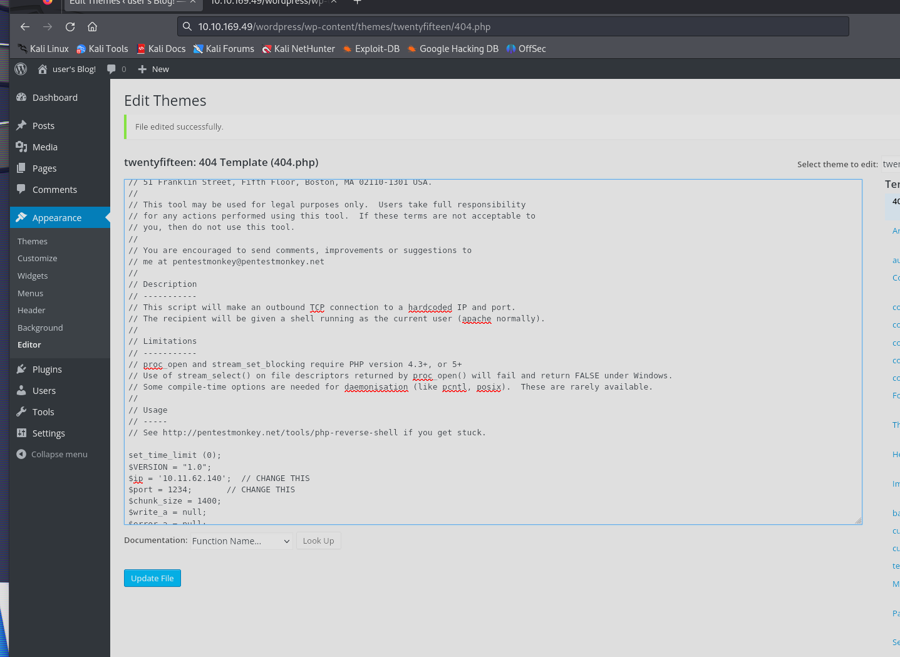
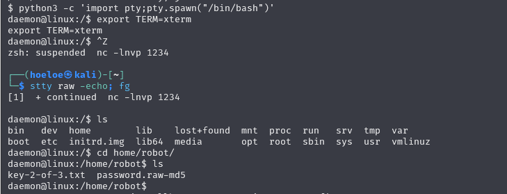

# OSINT

I have watched the MrRobot series, but for people who haven't, google results for it show the main characters:
elliot
mr robot
tyrell welleck
darlene

These could all be possible usernames if we need any login.

# Enumeration
## Nmap
sudo nmap -sC -sV  -oA nmap 10.10.2.175

## Gobuster
`gobuster dir -u http://10.10.2.175 -w /usr/share/wordlists/seclists/Discovery/Web-Content/directory-list-2.3-medium.txt`

## Interesting pages

**/robot**

The /robot gives a few potential new pages. Let's see if we can reach them ourselves.
**/fsocity.dic**  
This page lets us download a dict file containing the following list:

**/key-1-of-3.txt** 
This page gives us our first flag!

Flag 1: 073403c8a58a1f80d943455fb30724b9

/readme
Nothing really interesting here.

/sitemap
Not sure if this is usable either

/license
This is a very interesting page...
At first, it looked like nothing, but then I saw some text below

Then I noticed that I was able to scroll even further down and found the following:

## Getting initial foothold

I figured this might be a hash, so I used [the hash identifier](https://hashes.com/en/tools/hash_identifier) to figure out what hash this is, but it seems the text is base64 encoded.

So I copied the text in [this base64 decoder](https://www.base64decode.org/) and got the following result:

We have now found that one of the users is 'elliot' and we might even have his password.
Lets go to the /wp-login.php page to login with:
username: Elliot
password: ER28–0652

Succes!

Now lets see what we can do with this Wordpress access. We have admin access on the platform, so we should be able to do something here. Lets have a look around. 

On the 'pages' page, I see no current page, but only this deleted one.

I restored it to see if there was anything there, but it contained no clues. Tho, here I am able to create a page here and upload it with a new link. Maybe this is exploitable. 

On the 'Users' page, we find that there is another user: Krista Gordon. Elliot's therapist. Perhaps this username is needed for later flags. In the series, he hacked her, maybe they used the same password here? 

After looking around, we retrieved the WP version, which is 4.3.1 and can now search for vulnerabilities.

Found [the following vulnerability to upload a reverse shell with the appearance editor](https://www.hackingarticles.in/wordpress-reverse-shell/).
In short: You can update template pages and WP has a 404 error template, which is a PHP page. This page we can exploit using a PHP reverse shell. I used the PHP reverse shell from [PentestMonkey](https://github.com/pentestmonkey/php-reverse-shell) , only changing my IP address and port 1234, which is my go to port to listen on.

After uploading, I could access the 404 template on which I got from the vulnerability guide:
http://10.10.100.13/wordpress/wp-content/themes/twentyfifteen/404.php

After getting the access, I like to stabilize the shell, with the following commands:
1. `python3 -c 'import pty;pty.spawn("/bin/bash")'`
2. `export TERM=xterm`
3. hit ctrl-z to background the session
4. `stty raw -echo; fg`

Now we can have a look around with a normal terminal (auto complete, can cancel commands with ctrl-c without killing the shell, etc).

In the home folder, there is a user 'robot', where we can see the next flag, but we don't have the permission to view it. There is a password file there for robot.

We can see it is a md5 hash, so we can use john to crack it

We got our password, let's see if we can use it by switching to the 'robot' user.
This worked! So we now have the following credentials:
Username: robot
Password: abcdefghijklmnopqrstuvwxyz

After switching to the robot user, we are able to open the second flag:

# PrivEsc

First thing I always check, is to just run `sudo -l` to check if the user has any sudo rights that we can use to escalate our privileges, unfortunately, this yielded nothing.

Then my next step is to upload [Linpeas](https://github.com/carlospolop/PEASS-ng/tree/master/linPEAS) on the machine to enumerate all possible exploits on the machine to get to root. Got it in the /tmp folder, as we are not allowed to wget files anywhere else.
Running the script, we get the following interesting SUID exploits

It looks like we are able to exploit using the NMAP binary, lets see what we can do.

Had a quick peek on GTFOBins, but couldn't really make that work, but I was certain that NMAP should be working to get root. 

[The following guide on exploit NMAP with Setuid](https://www.adamcouch.co.uk/linux-privilege-escalation-setuid-nmap/) looked promising. I first entered
`nmap --interactive`
This gives us an interactive shell and guess what the user is?
`!whoami` resulted in root!
Now we just spawn a bash shell with the `!sh` command and we can move around and go to the root folder as the root user.
In the folder we find our last key:

